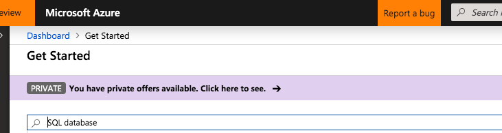

# Module 1: Provision resources for the workshop

You will need to provision the following resources: 
1.  Resource Group
2.  Storage Account (HNS enabled - ADLS gen2)
3.  Azure SQL Database
4.  Azure Data Factory

### 1.0. Provision a resource group in your Azure subscription

### 2.0. Provision a storage account (v2, hot tier, with HNS enabled) in your resource group

2.0.1. Go to the resource group and click on "Add" 

2.0.2. Look for storage account 

2.0.3. Click create 

2.0.4. Fill in the details 

2.0.5. Enable HNS 

2.0.6. Validate and create 

2.0.7.  Storage account should be visible in your resource group

### 3.0. Provision a SQl database

3.0.1. Go to the resource group and click on "Add", then search for "SQL database" 

3.0.2. Click create 

3.0.3. Create a new logical database server 

3.0.4. Enter server details 

3.0.2. Click create 

3.0.2. Click create 

3.0.2. Click create 

### 4.0. Provision a Data Factory

4.0.1. Go to the resource group and click on "Add" 

4.0.2. Search for "data Factory" 

4.0.3. Enter details 

4.0.4. Click create 

4.0.5. You shoudl see the service in your resource group 

