# Module 2: Copy workshop data using Azure DAta Factory "Copy Activity"

In this module you will (one-time) copy data from the instructor's storage account (blob storage) to your own (ADLS Gen2). 
You will need the storage account key fron your instructor in order to copy data from their account.

### 1. Launch Data Factory provisioned

### 2.  Create a on-time copy activity

### 3.  Configure source - your instructor's storage account

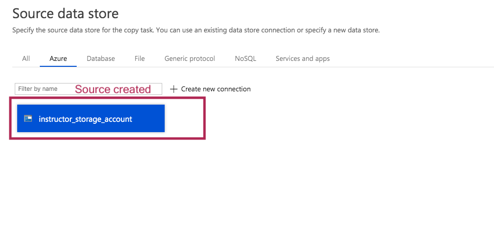

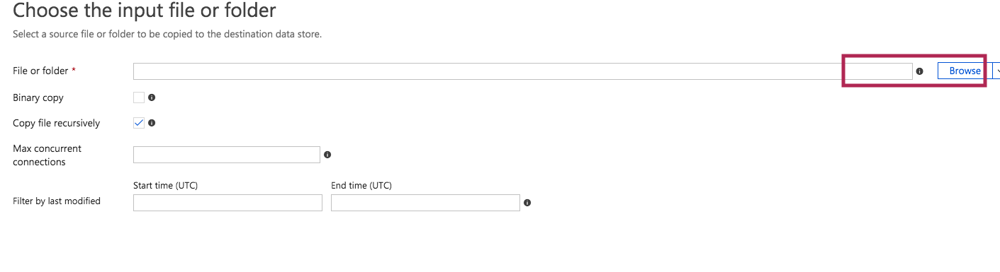

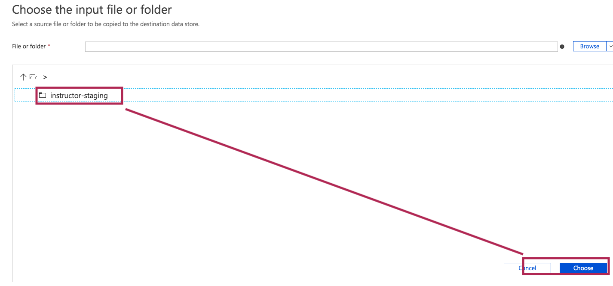

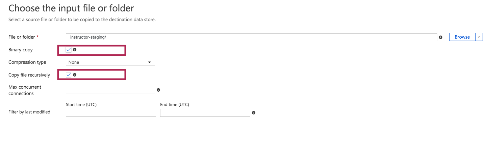

### 4.  Configure sink - your ADLS Gen2 storage account

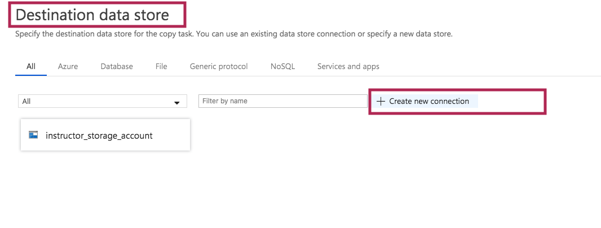

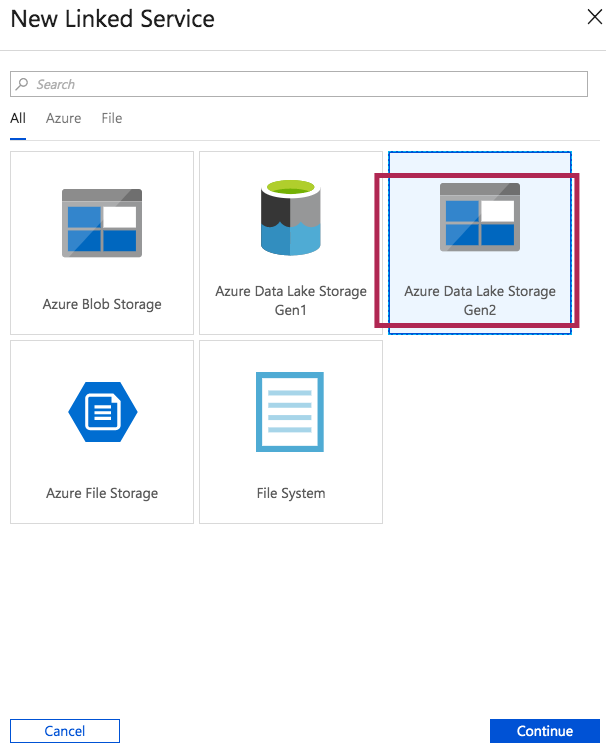

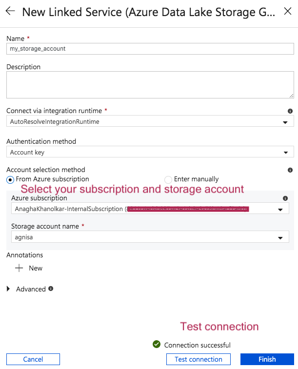

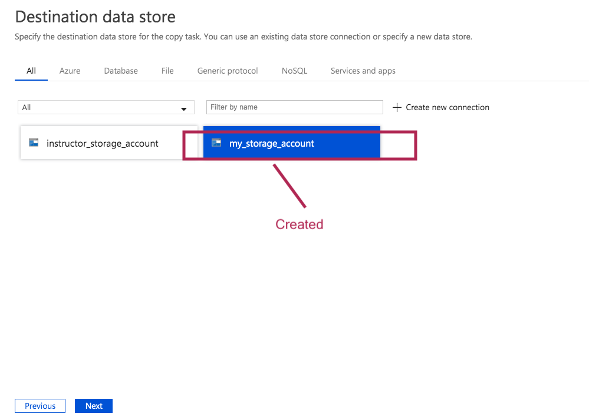

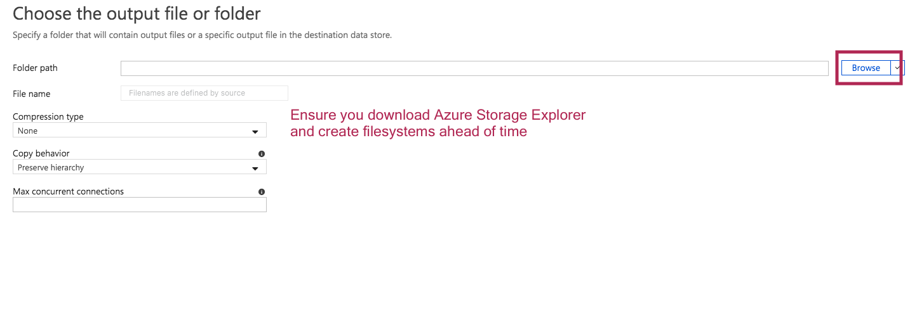

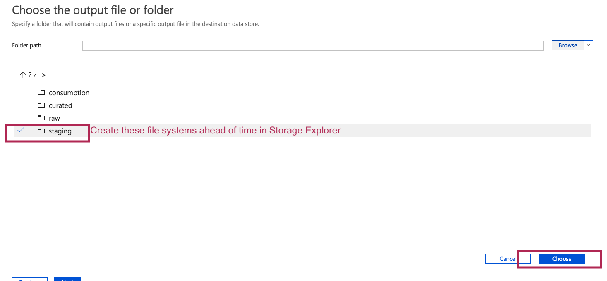

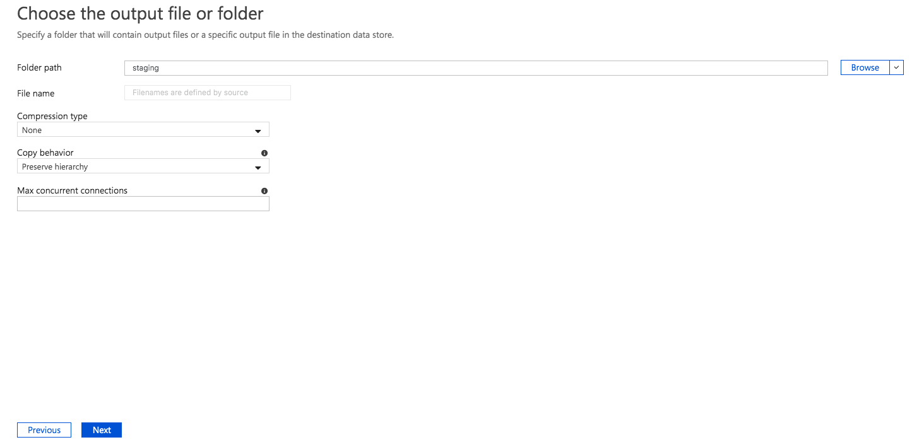

### 5.  Configure performance and other details

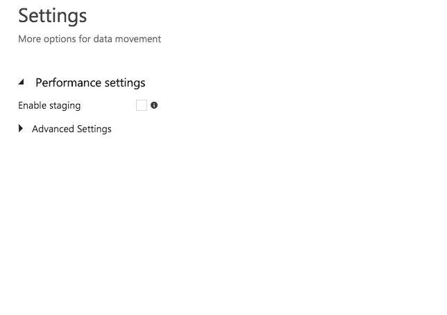

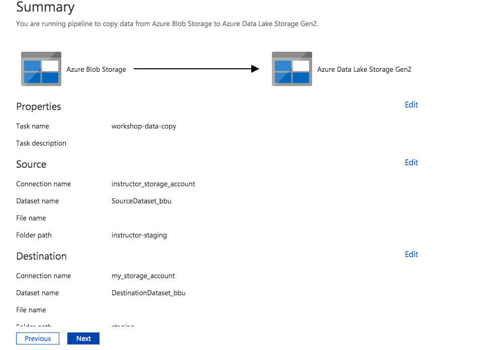

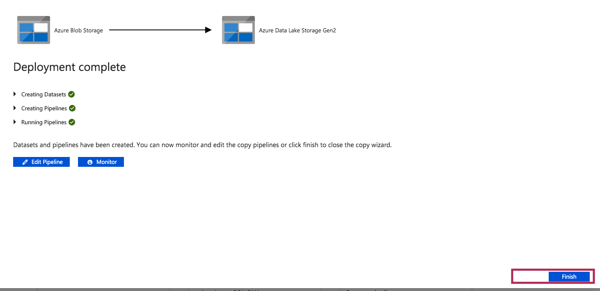

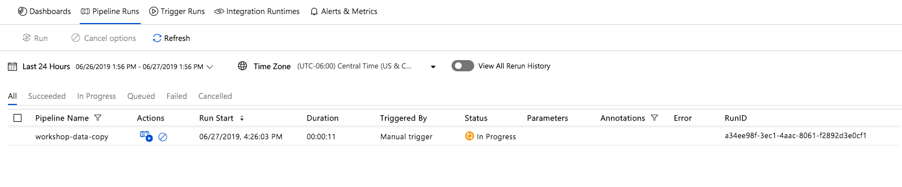

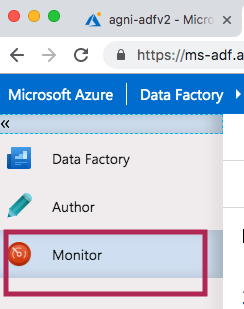

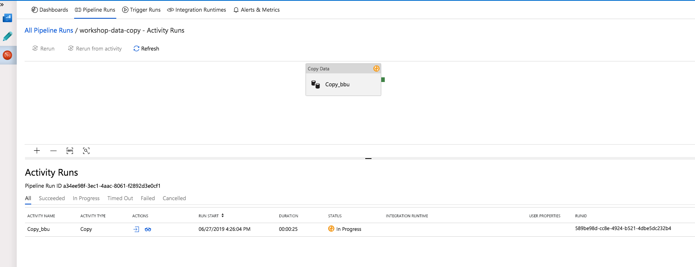

