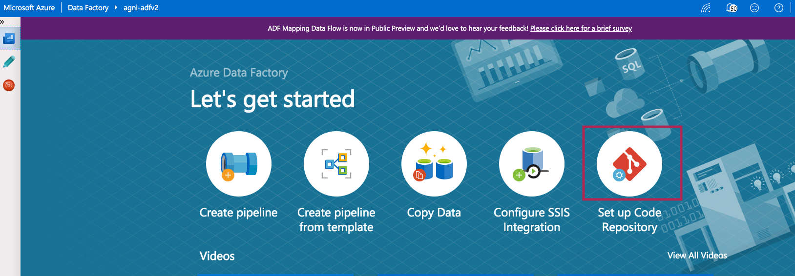
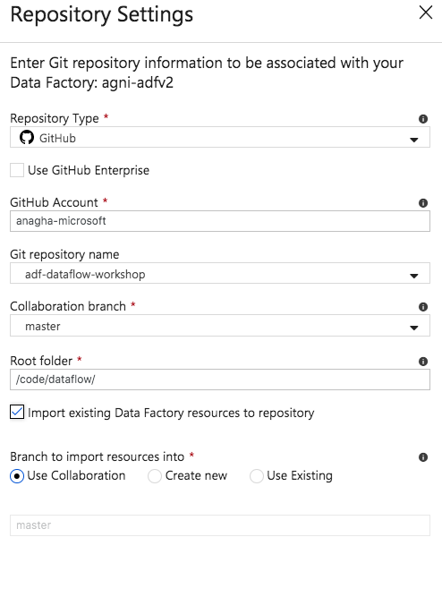
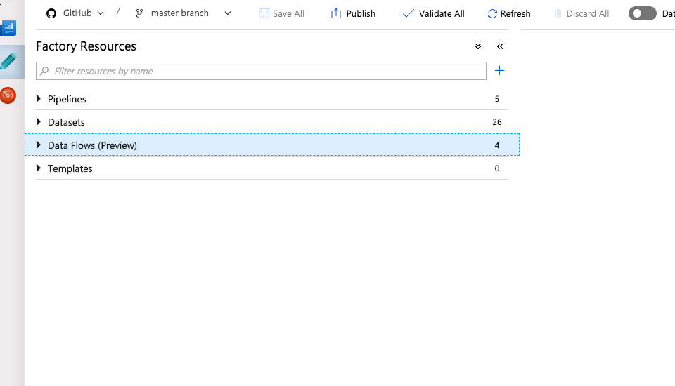

# Module 3: Import workshop pipelines and associated artifacts from Git

### 3.1. Create a git account if you dont have one

### 3.2. Fork the workshop base artifacts

From the git UI, navigate to https://github.com/anagha-microsoft/adf-dataflow-base and click on "fork".

### 3.3. The state of your ADF when you start out

### 3.4. Import the artifacts in the fork you created into your ADF

#### 3.4.1. Click on "Git repository"

#### 3.4.2. Enter your git repo details

### 3.4. Post import...

Here is what your ADF should look like now.

### 3.4. Lets do a validation to ensure things look good

- Its important that you call your ADLS Gen 2 connection the same as what the instructor did for validation to be successful. 
- No fear if you named it differently, just extra work. 
- Go to every single dataset and reflect the correct linked service. (Fun :)) 

You can now proceed to the next module.
