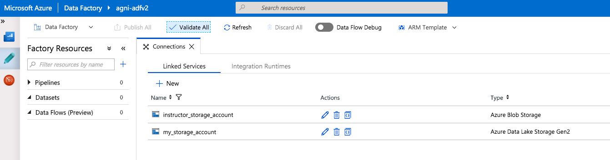

# Module 3: Import workshop pipelines and associated artifacts from Git

### 3.1. Create a git account if you dont have one

### 3.2. Fork the workshop base artifacts

From the git UI, navigate to https://github.com/anagha-microsoft/adf-dataflow-base and click on "fork".

### 3.3. The state of your ADF when you start out

### 3.4. Import the artifacts in the fork you created into your ADF

