# Module 4a: Load reference data from staging to raw zone into Paruet

In this module - we will review all the artifacts we imported for reference data in a detailed fashion and learn from them. 

The data engineering work done in this module is - 
Read reference data in CSV format in the staging zone, transform to a more optimal format (space and query efficient), parquet to the raw zone. 

## 4a.1: Dataset review

### 4a.1.1. Lets review our storage account setup

There are 4 file sstems - one for each information zone. 
staging 
raw 
curated 
consumption 

We will read from staging and persist to parquet in the raw infomation zone.

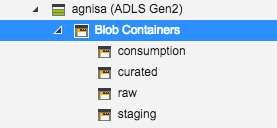

### 4a.1.2. Lets review the data in the staging directory

Lets look at the data in the staging zone.

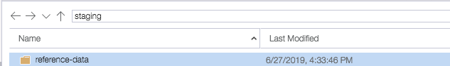

Peek a little deeper.

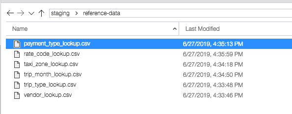

### 4a.1.3. Create datasets

This is a foundational task.  In your case, the dataset configuration artifacts have been imported, so you dont really have to import anything.  Notice how they are organized into directories/folders?  Simplies organization and should you ever need to delete - can do easily at a directory level.  

For each entity, we have one staging dataset and one raw dataset - consider these metadata. 
Lets take one dataset and review both the raw and staging configuration.

#### 4a.1.3.1. Payment type - staging

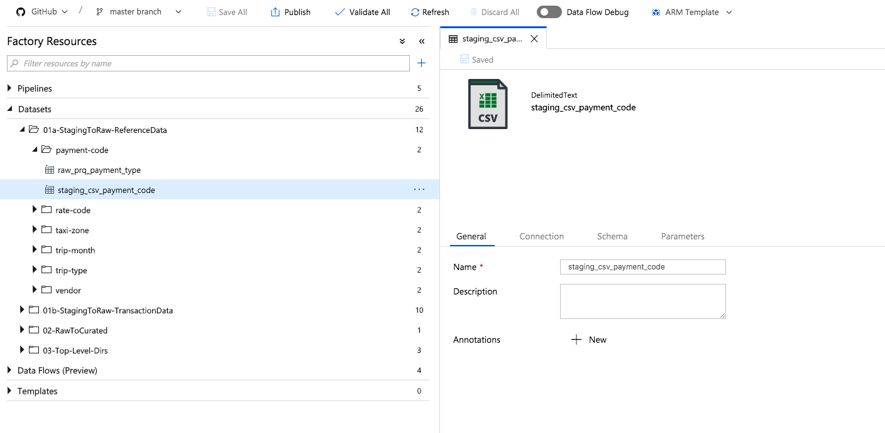

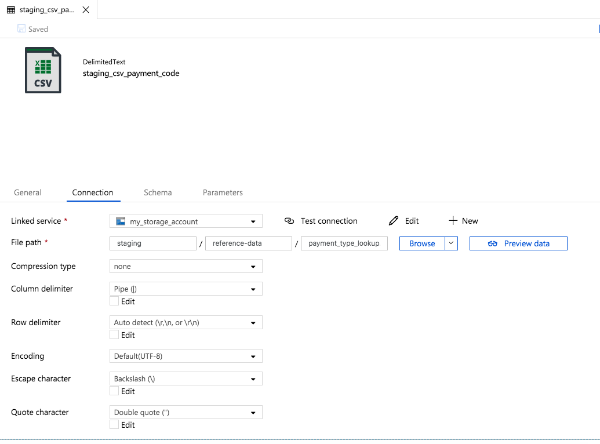

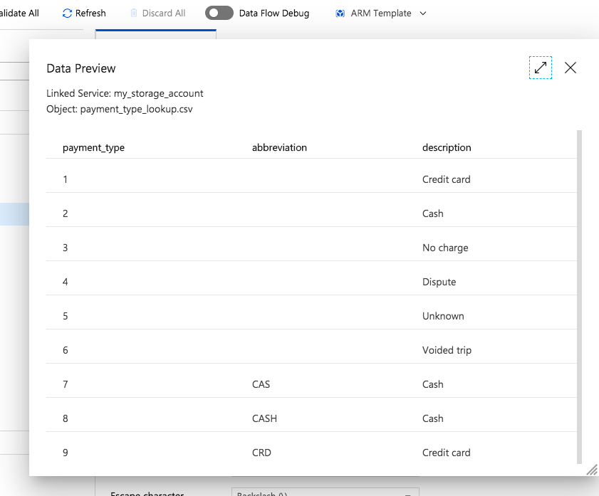

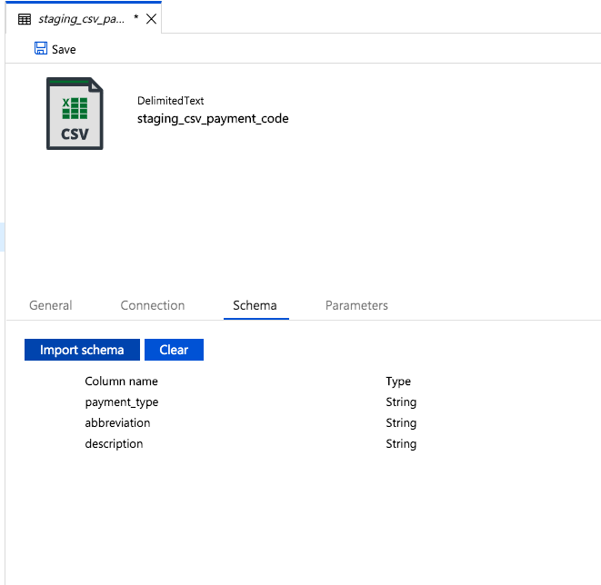

#### 4a.1.3.2. Payment type - raw

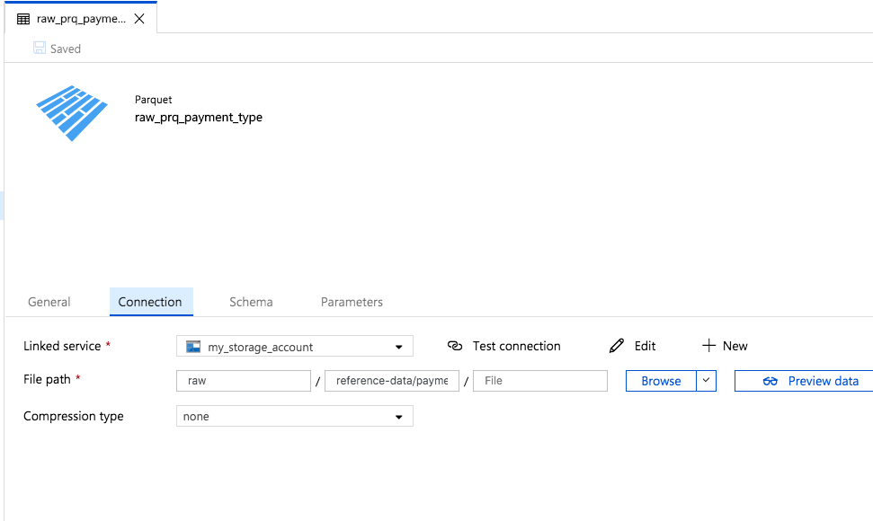

## 4a.2: Dataflow review

#### 4a.2.1. Navigate to the Load Reference Data Dataflow

Expand the Data Flow section, then expand the "01-LoadFromStaging" directory and click on "Load-Reference-Data"

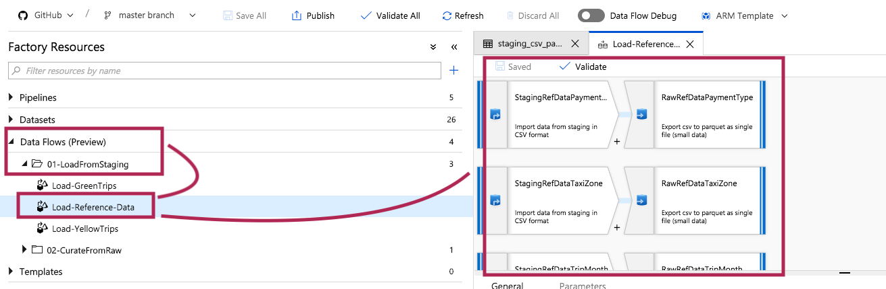

#### 4a.2.2. Note that there are 6 reference datasets and you should see a sub-flow for each

These will run in parallel.

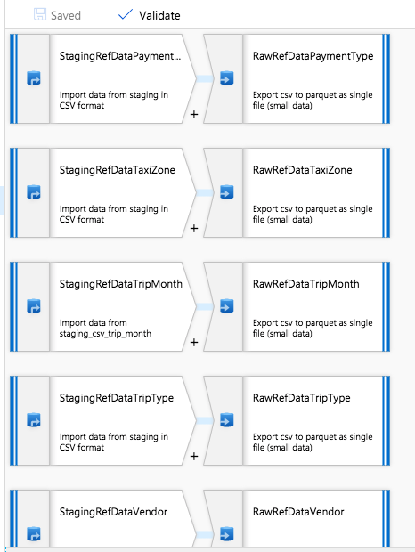

We will zone in on Payment Type and learn.

#### 4a.2.3. Lets look at the source  for Payment type

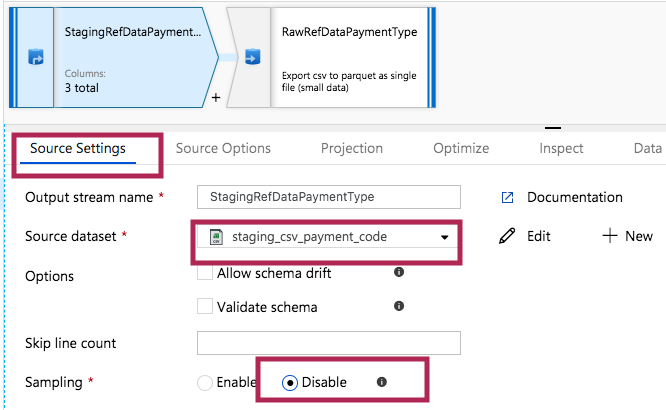

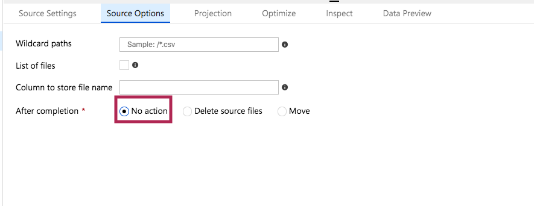

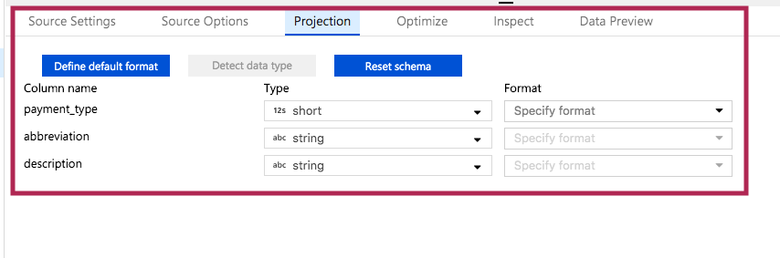

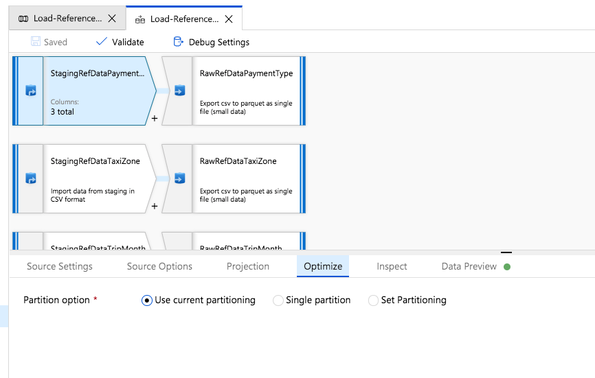

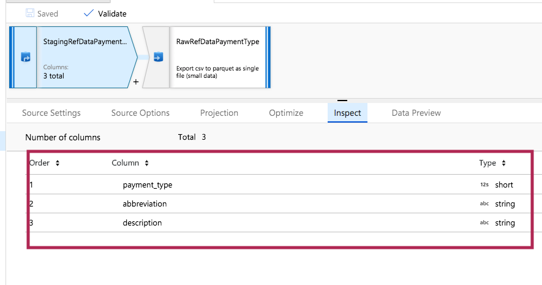

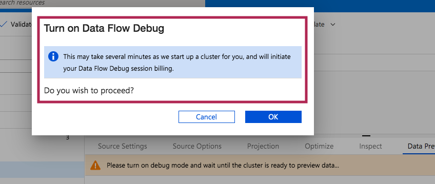

