# Module 4a: Load reference data from staging to raw zone into Paruet

In this module - we will review all the artifacts we imported for reference data in a detailed fashion and learn from them. 

The data engineering work done in this module is - 
Read reference data in CSV format in the staging zone, transform to a more optimal format (space and query efficient), parquet to the raw zone. 

## 4a.1: Dataset review

### 4a.1.1. Lets review our storage account setup

There are 4 file sstems - one for each information zone. 
staging 
raw 
curated 
consumption 

We will read from staging and persist to parquet in the raw infomation zone.

### 4a.1.2. Lets review the data in the staging directory

Lets look at the data in the staging zone.

Peek a little deeper.

### 4a.1.3. Create datasets

This is a foundational task.  In your case, the dataset configuration artifacts have been imported, so you dont really have to import anything.  Notice how they are organized into directories/folders?  Simplies organization and should you ever need to delete - can do easily at a directory level.  

For each entity, we have one staging dataset and one raw dataset - consider these metadata. 
Lets take one dataset and review both the raw and staging configuration.

#### 4a.1.3.1. Payment type - staging

#### 4a.1.3.2. Payment type - raw

## 4a.2: Dataflow review

#### 4a.2.1. Navigate to the Load Reference Data Dataflow

Expand the Data Flow section, then expand the "01-LoadFromStaging" directory and click on "Load-Reference-Data"

#### 4a.2.2. Note that there are 6 reference datasets and you should see a sub-flow for each

These will run in parallel.

We will zone in on Payment Type and learn.

#### 4a.2.3. Lets look at the source  for Payment type

Note that if you click on "Detect Type", it will read source file and populate the schema and you can change data types here.

Select "current partitioning" as shown below - we have a very small set of data - partitioning is an anti-pattern for small data as it degrades performance.

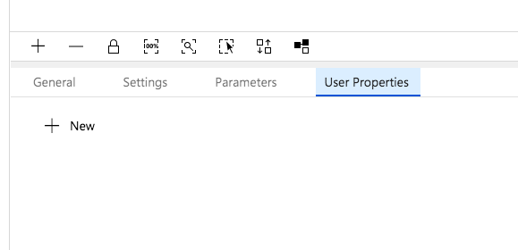

To preview, we have to have **debug** on.  This spinds up a Dtaabricks runtime to execute the Dataflow for developing/debugging.

You should see this dialog show up. Give it 5-10 minutes.

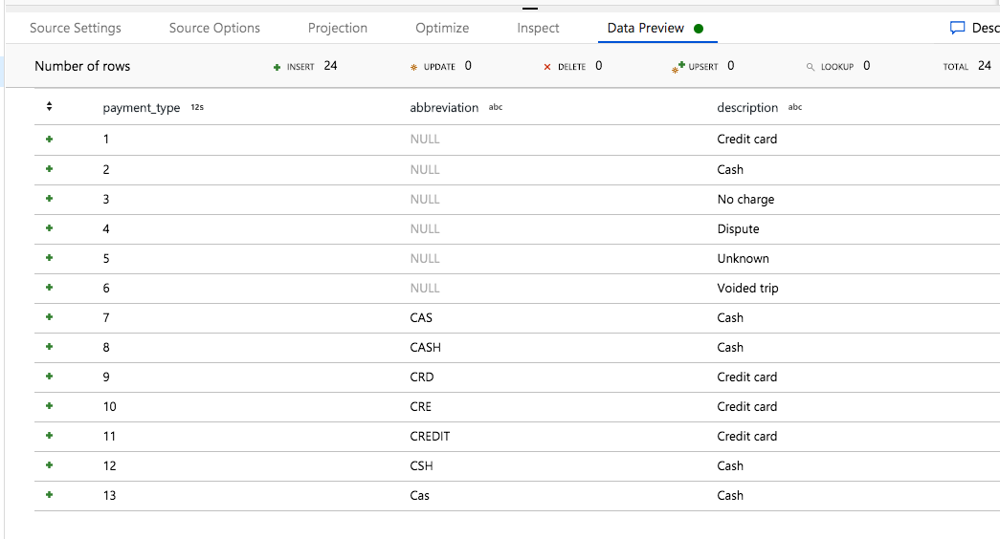

images

#### 4a.2.4. Lets look at the sink for Payment type

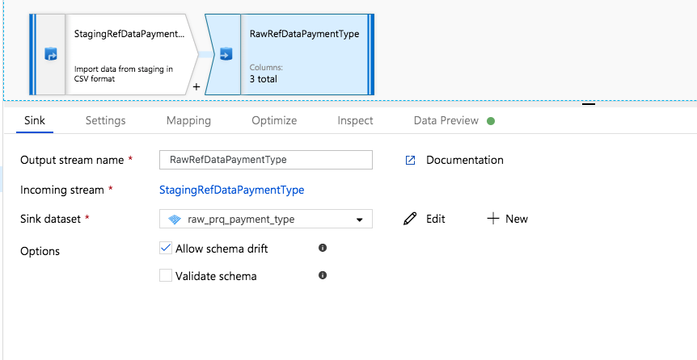

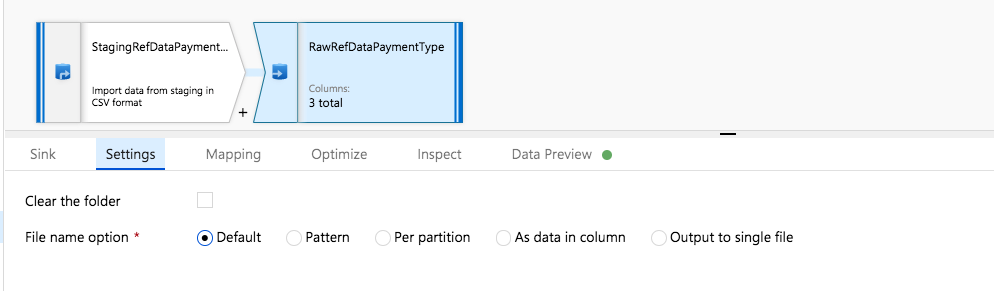

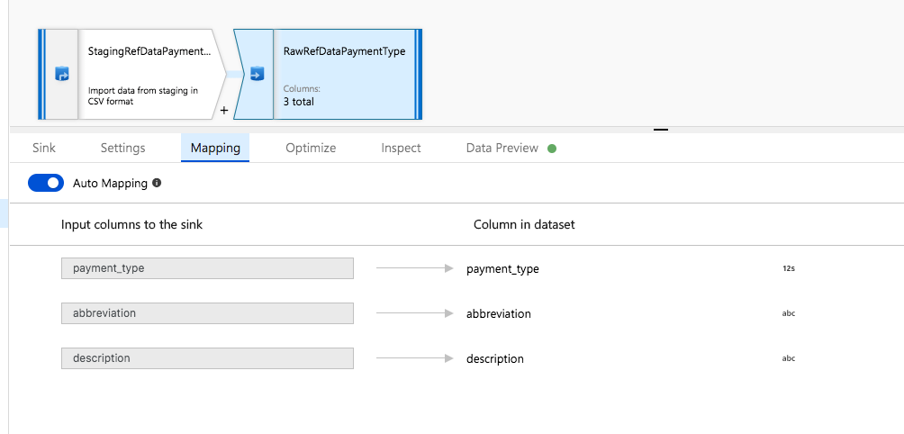

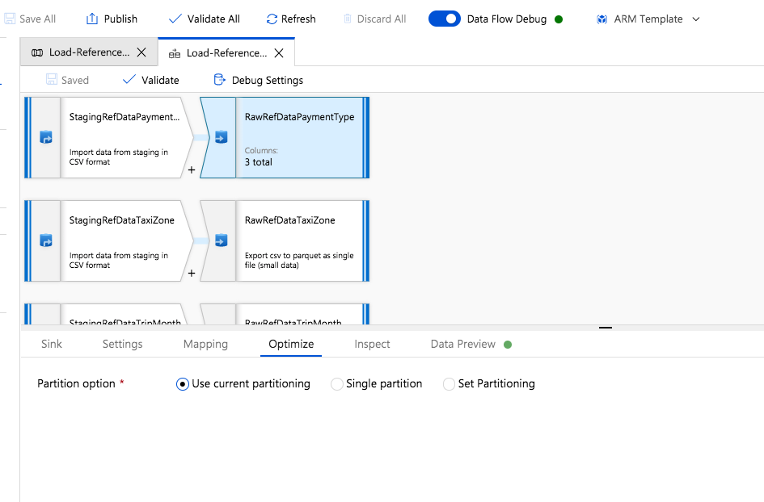

### 4a.3. If you have extra time, review the rest of the sub-flows

They are essentially identical in configuration.
Otherwise, skip to the next section below.

### 4a.4. Lets test the dataflow through a pipeline

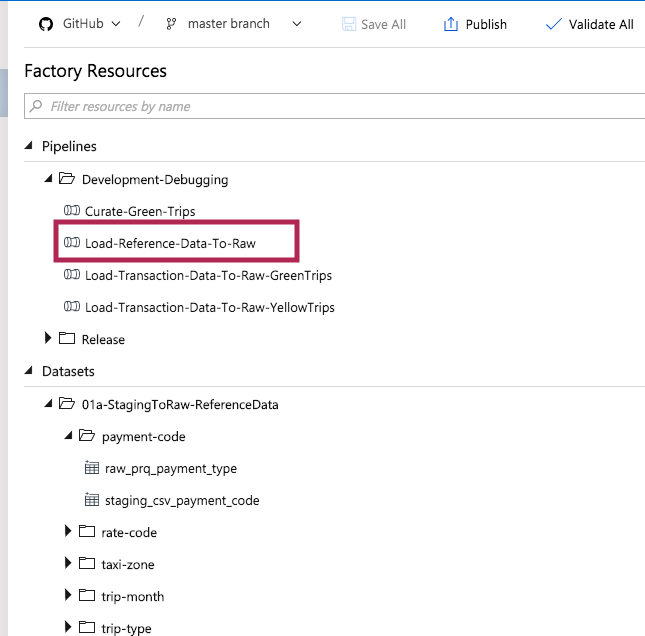

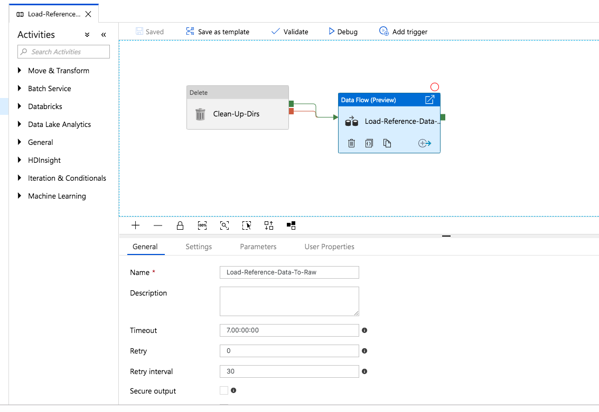

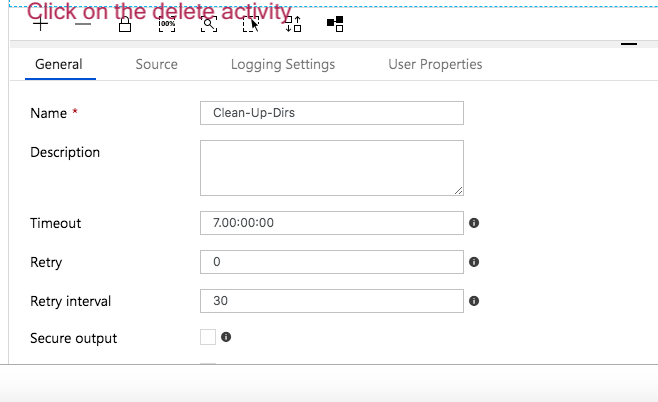

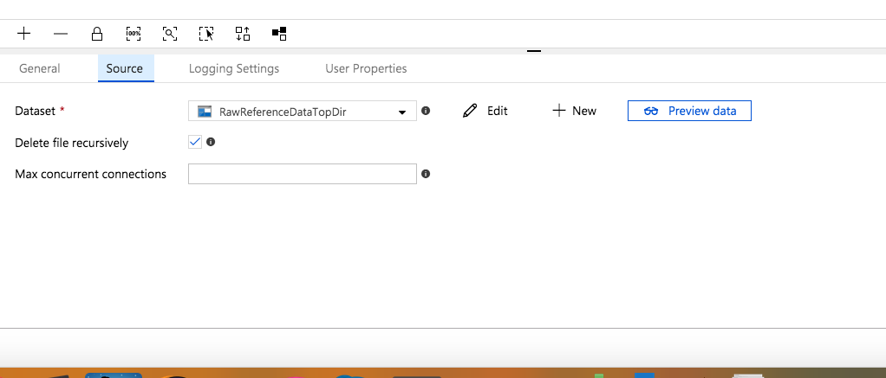

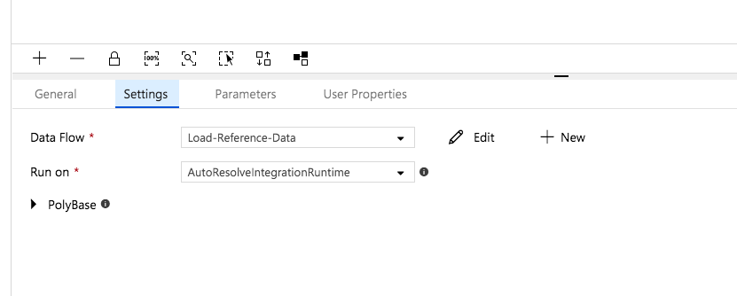

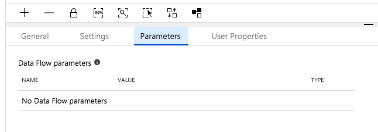

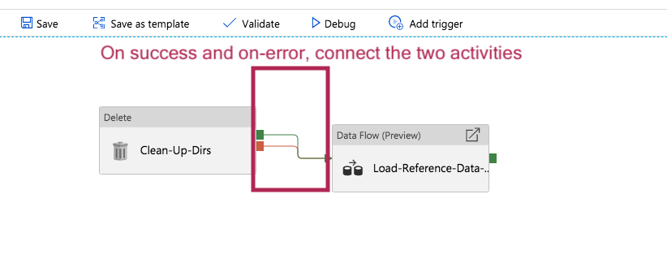

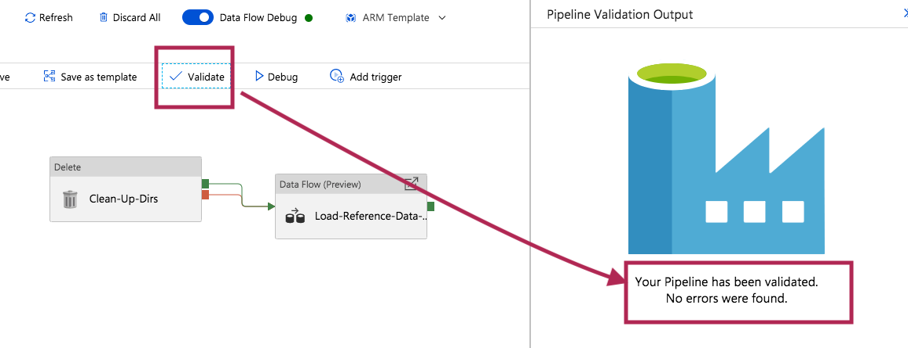

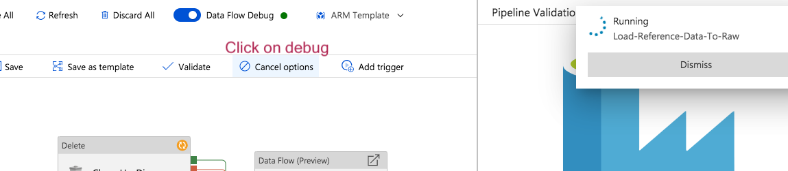

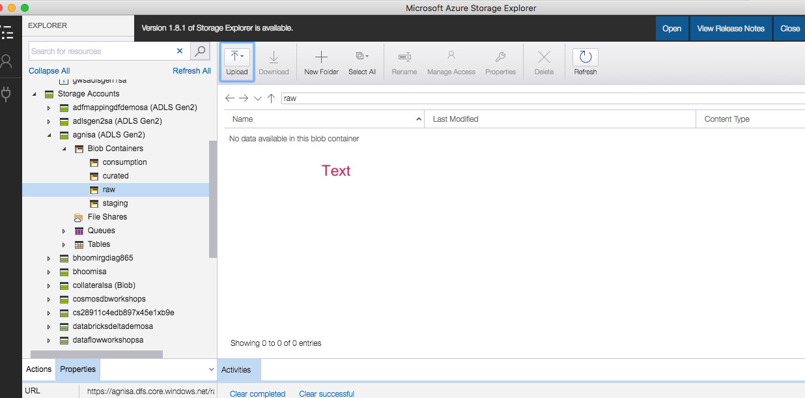

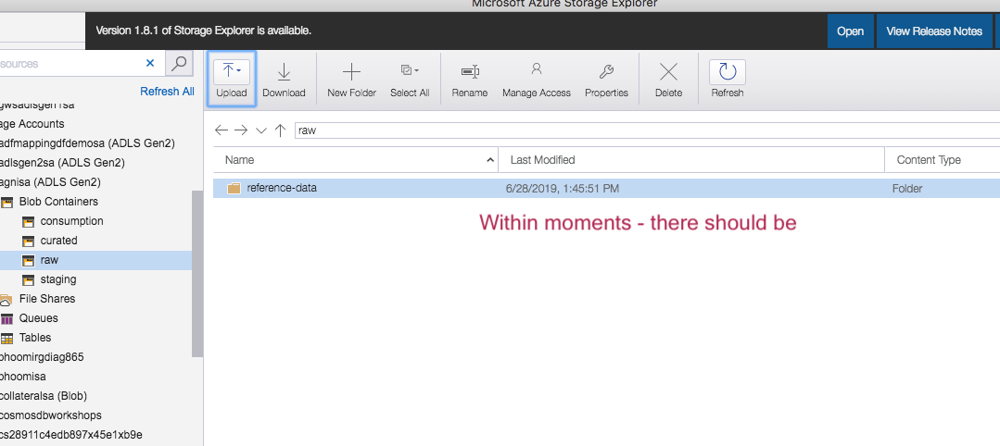

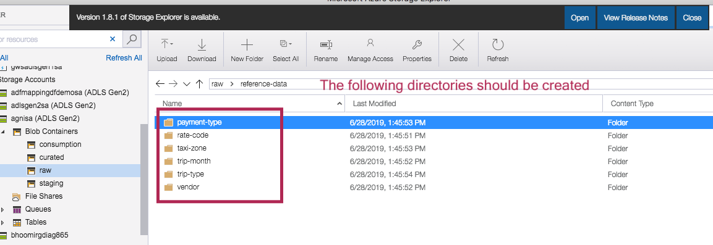

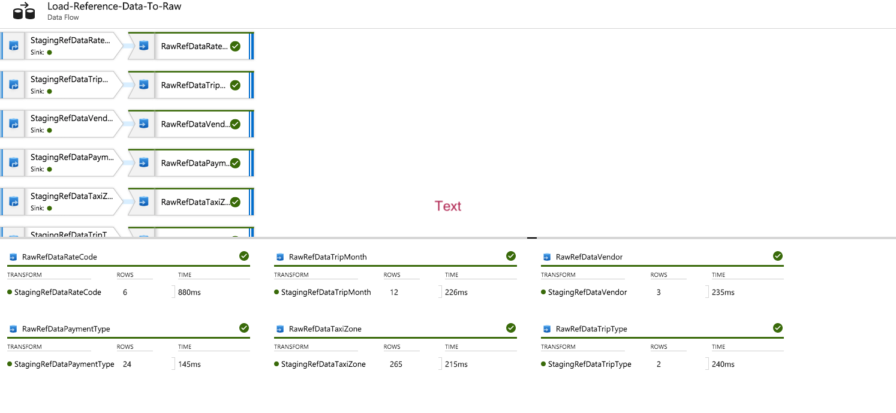

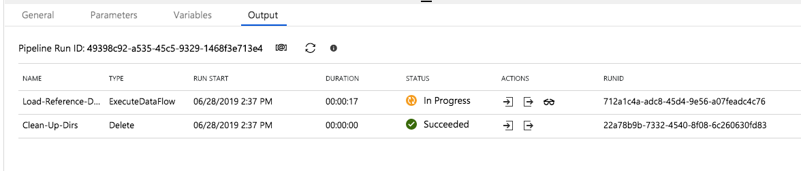

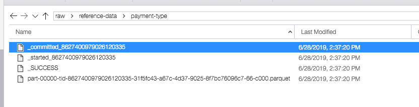

